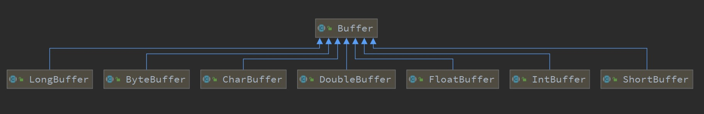
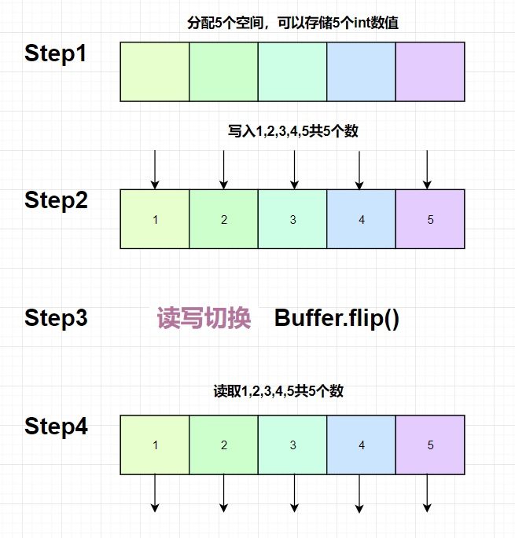

# 10011-buffer基本使用



**实现Buffer接口的是JAVA8个基本类型中除了布尔类型外的7个类型**

Buffer简单使用的代码片段如下：

```java
import java.nio.IntBuffer;

/**
 * @description:Buffer的基本操作：写入、反转、读取
 * @author:mangxiao2018@126.com
 * @date:2021-1-11
 */
public class BufferTestCase {

    public static void main(String[] args){
        // 创建一个IntBuffer，大小为5，可以存放5个int数值
        IntBuffer buffer = IntBuffer.allocate(5);
        // 写入
        for (int i=1; i<=5; i++){
            buffer.put(i);
        }
        // 将buffer转换，读写切换
        buffer.flip();
        //读取
        while (buffer.hasRemaining()){
            System.out.println((int)buffer.get());
        }
    }
}
```


