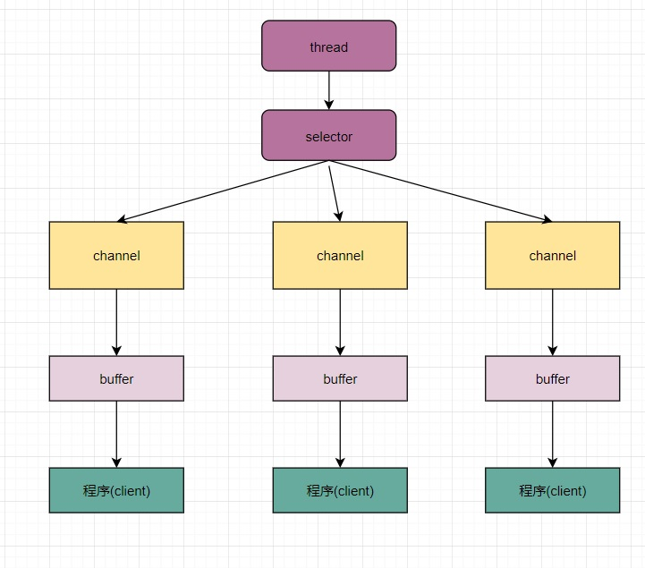

# 10012-Selector、Channel、Buffer关系

selector、channel、buffer关系图

关系图说明：

1、每个channel都会对应一个buffer

2、每个selector对应一个线程，每个线程对应多个channel（也可称做连接）

3、该图反应了有三个channel注册到该selectory/程序

4、程序切换到哪个channel是由事件决定的，Event就是一个重要的概念

5、selector会根据不同的事件，在各个通道上切换

6、buffer就是一个内存块，底层是一个数组

7、数据的读取写入是通过buffer，这个和BIO，BIO中要么是输入流，要么是输出流，不能是双向的，但是NIO的buffer是可以读，也可以写的，需要flip方法来切换

8、channel是双向的，可以返回底层操作系统的情况，比如Linux,底层的操作系统通道就是双向的。