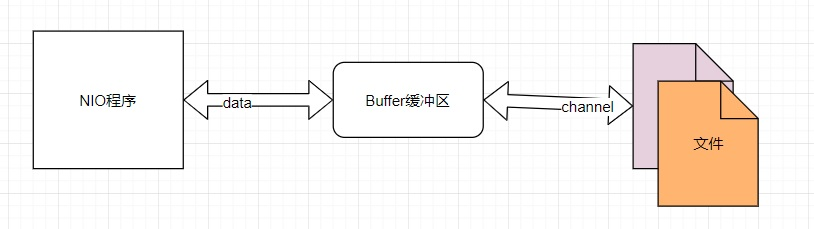
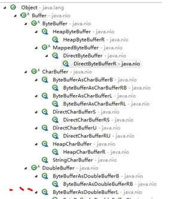
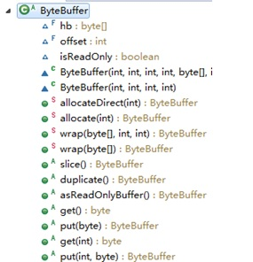

# 10013-缓冲区Buffer

**缓冲区（****Buffer****）**：缓冲区本质上是一个可以读写数据的内存块，可以理解成是一个**容器对象****(****含数组****)**，该对象提供了**一组方法**，可以更轻松地使用内存块，，缓冲区对象内置了一些机制，能够跟踪和记录缓冲区的状态变化情况。Channel 提供从文件、网络读取数据的渠道，但是读取或写入的数据都必须经由 Buffer。



**Buffer** **类及其子类**

1) 在 NIO 中，Buffer 是一个顶层父类，它是一个抽象类, 类的层级关系图



**常用****Buffer****子类一览**

\1) ByteBuffer，存储字节数据到缓冲区

\2) ShortBuffer，存储字符串数据到缓冲区

\3) CharBuffer，存储字符数据到缓冲区	

\4) IntBuffer，存储整数数据到缓冲区

\5) LongBuffer，存储长整型数据到缓冲区

\6) DoubleBuffer，存储小数到缓冲区

\7) FloatBuffer，存储小数到缓冲区

**Buffer类及其子类重要的4个属性**

| **属性** | **描述**                                                     |
| -------- | ------------------------------------------------------------ |
| Capacity | 容量，即可以容纳的最大数据量；在缓冲区创建时被设定并且不能改变 |
| Limit    | 所限制的最大位置值，该值要小于等于Capacity.表示缓冲区的当前终点，不能对缓冲区超过极限的位置进行读写操作。且极限是可以修改的 |
| Position | 当前位置，Position最大值不能超过Limit，下一个要被读或写的元素的索引，每次读写缓冲区数据时都会改变改值，为下次读写作准备 |
| Mark     | 标记                                                         |

4个属于值范围大小关系：mark <= position <= limit <= capacity

  private int mark = -1; 初始状态

  private int position = 0; 初始状态

  private int limit;  初始状态

  private int capacity; 初始状态

**Buffer方法解析**

*红色字体的为常用方法*

```java
public abstract class Buffer{
   //JDK1.4时，引入的api
    public final int capacity( )//返回此缓冲区的容量 [常用]
    public final int position( )//返回此缓冲区的位置 [常用]
    public final Buffer position (int  newPositio)//设置此缓冲区的位置 [常用]
    public final int limit( )//返回此缓冲区的限制 [常用]
    public final Buffer limit (int newLimit)//设置此缓冲区的限制 [常用]
    public final Buffer mark( )//在此缓冲区的位置设置标记
    public final Buffer reset( )//将此缓冲区的位置重置为以前标记的位置
    public final Buffer clear( )//清除此缓冲区,即将各个标记恢复到初始状态，但是数据并没有真正擦除,后面操作会覆盖 [常用]
    public final Buffer flip( )//反转此缓冲区 [常用]
    public final Buffer rewind( )//重绕此缓冲区
    public final int remaining( )//返回当前位置与限制之间的元素数
    public final boolean hasRemaining()//告知在当前位置和限制之间是否有元素 [常用]
    public abstract boolean isReadOnly();//告知此缓冲区是否为只读缓冲区 [常用]

   //JDK1.6时引入的api
    public abstract boolean  hasArray();//告知此缓冲区是否具有可访问的底层实现数组 [常用]
    public abstract Object array();//返回此缓冲区的底层实现数组 [常用]
    public abstract int arrayOffset();//返回此缓冲区的底层实现数组中第一个缓冲区元素的偏移量
    public abstract boolean isDirect();//告知此缓冲区是否为直接缓冲区
}
```


**ByteBuffer方法解析**

从前面可以看出对于 Java 中的基本数据类型(boolean除外)，都有一个 Buffer 类型与之相对应，最常用的自然是ByteBuffer 类（二进制数据），该类的主要方法如下:

```java
public abstract class ByteBuffer {
    //缓冲区创建相关api
    public static ByteBuffer allocateDirect(int capacity)//创建直接缓冲区
    public static ByteBuffer allocate(int capacity)//设置缓冲区的初始容量
    public static ByteBuffer wrap(byte[] array)//把一个数组放到缓冲区中使用
    //构造初始化位置offset和上界length的缓冲区
    public static ByteBuffer wrap(byte[] array,int offset, int length)
    //缓存区存取相关API
    public abstract byte get( );//从当前位置position上get，get之后，position会自动+1
    public abstract byte get (int index);//从绝对位置get
    public abstract ByteBuffer put (byte b);//从当前位置上添加，put之后，position会自动+1
    public abstract ByteBuffer
    put (int index, byte b);//从绝对位置上put

 }
```


