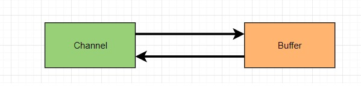
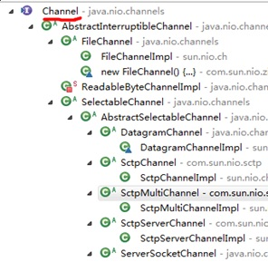

# 10014-通道Channel基本介绍

**1、**NIO的通道类似于流，但有些区别如下：

- 通道可以同时进行读写，而流只能读或者只能写
- 通道可以实现异步读写数据
- 通道可以从缓冲读数据，也可以写数据到缓冲

**2、**BIO 中的 stream 是单向的，例如 FileInputStream 对象只能进行读取数据的操作，而 NIO 中的通道(Channel)是双向的，可以读操作，也可以写操作。

**3、**Channel在NIO中是一个接口

**public interface Channel extends Closeable{}**

**4、**常用的 Channel 类有：FileChannel、DatagramChannel、ServerSocketChannel 和 SocketChannel。【ServerSocketChanne 类似 ServerSocket , SocketChannel 类似 Socket】

**5、**FileChannel 用于文件的数据读写，DatagramChannel 用于 UDP 的数据读写，ServerSocketChannel 和 SocketChannel 用于 TCP 的数据读写。

