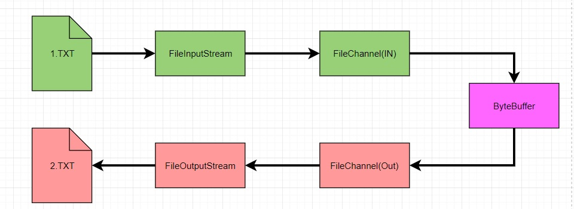

# 10018-使用一个Buffer完成文件写读

*1.TXT->FileInputStream->FileChannel(IN)->ByteBuffer->FileChannel(OUT)->FileOutputStream->2.TXT*

**类FileChannelTestCase的代码片段**

```java
 /**
     * 通过FileInputStream,FileOutStream,FileChannel进行数据的读取写入
     * @throws Exception
     */
    public static void inAndOutStream() throws Exception {
        FileInputStream fileInputStream = new FileInputStream("d:\\04.txt");
        FileChannel fileChannel_a = fileInputStream.getChannel();

        FileOutputStream fileOutputStream = new FileOutputStream("d:\\05.txt");
        FileChannel fileChannel_b = fileOutputStream.getChannel();

        ByteBuffer byteBuffer = ByteBuffer.allocate(512);

        while(true){
            //这里有一个重要的操作，一定不要忘了
            /*
             public final Buffer clear() {
                position = 0;
                limit = capacity;
                mark = -1;
                return this;
            }
             */
            byteBuffer.clear();//清空buffer
            int read = fileChannel_a.read(byteBuffer);
            System.out.println("read=" + read);
            if (read == -1){
                break;
            }
            //将buffer 中的数据写入到 fileChannel_b -- 05.txt
            byteBuffer.flip();
            fileChannel_b.write(byteBuffer);
        }
        //关闭相关的流
        fileInputStream.close();
        fileOutputStream.close();
    }
```




