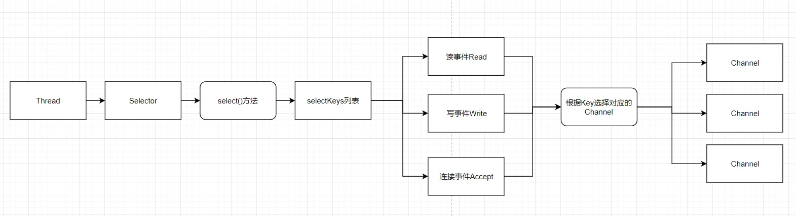
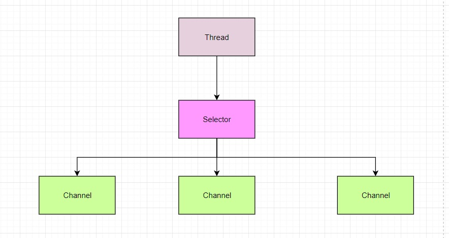

# 10021-Selector基本介绍

**Selector与Channel间的原理图**

**Selector基本介绍**

1、Java 的 NIO，用非阻塞的 IO 方式。可以用一个线程，处理多个的客户端连接，就会使用到**Selector(****选择器****)**

2、**Selector** **能够检测多个注册的通道上是否有事件发生****(****注意****:****多个****Channel****以事件的方式可以注册到同一个****Selector)**，如果有事件发生，便获取事件然后针对每个事件进行相应的处理。这样就可以只用一个单线程去管理多个通道，也就是管理多个连接和请求。【示意图】

3、只有在 连接/通道 真正有读写事件发生时，才会进行读写，就大大地减少了系统开销，并且不必为每个连接都创建一个线程，不用去维护多个线程

4、避免了多线程之间的上下文切换导致的开销