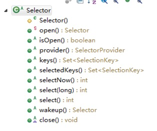

# 10023-Selector类相关方法

**Selector** **类**是一个抽象类, 常用方法和说明如下:

```java
public abstract class Selector   implements Closeable { 
    //得到一个选择器对象
    public static Selector open();

    //监控所有注册的通道，当其中有IO操作可以进行时，将对应的 SelectionKey
    加入到内部集合中并返回，参数用来设置超时时间
    public int select(long timeout);

    //从内部集合中得到所有的SelectionKey  
    public Set<SelectionKey>  selectedKeys();
}
```


