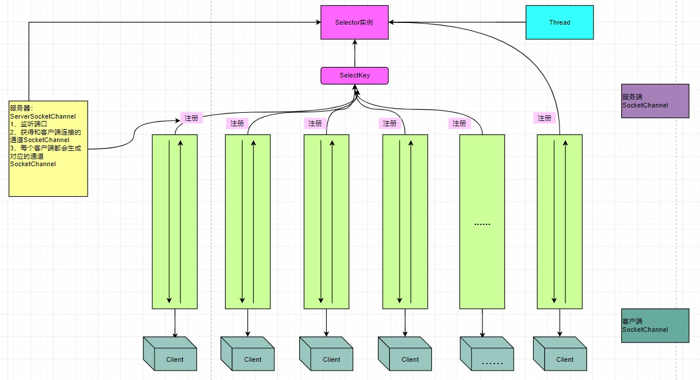

# 10025-NIO非阻塞 网络编程原理分析图

对上图的说明:

1.当客户端连接时，会通过ServerSocketChannel 得到 SocketChannel

2.Selector 进行监听 select 方法, 返回有事件发生的通道的个数.

3.将socketChannel注册到Selector上, register(Selector sel, **int** ops), 一个selector上可以注册多个SocketChannel

4.注册后返回一个 SelectionKey, 会和该Selector 关联(集合)

5.进一步得到各个 SelectionKey (有事件发生)

6.在通过 SelectionKey  反向获取 SocketChannel , 方法 channel()

7.可以通过 得到的 channel  , 完成业务处理