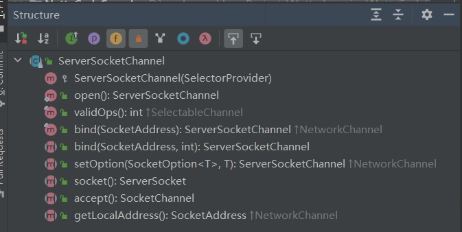
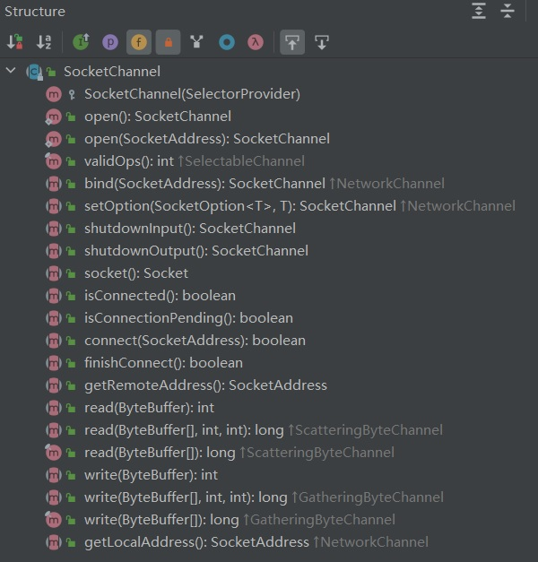

# 10028-ServerSocketChannel&SocketChannel

ServerSocketChannel

1、ServerSocketChannel 在**服务器端监听新的客户端** **Socket** **连**接

2、相关方法如下

**public abstract class** **ServerSocketChannel**

  **extends** AbstractSelectableChannel

  **implements** NetworkChannel{

public static ServerSocketChannel open()，得到一个 ServerSocketChannel 通道

public final ServerSocketChannel bind(SocketAddress local)，设置服务器端端口号

public final SelectableChannel configureBlocking(boolean block)，设置阻塞或非阻塞模式，取值 false 表示采用非阻塞模式

public SocketChannel accept()，接受一个连接，返回代表这个连接的通道对象

public final SelectionKey register(Selector sel, int ops)，注册一个选择器并设置监听事件

}

SocketChannel

1、SocketChannel，网络 IO 通道，**具体负责进行读写操作**。NIO 把缓冲区的数据写入通道，或者把通道里的数据读到缓冲区。

2、相关方法如下

**public abstract class** SocketChannel

  **extends** AbstractSelectableChannel

  **implements** ByteChannel, ScatteringByteChannel, GatheringByteChannel, NetworkChannel{

public static SocketChannel open();//得到一个 SocketChannel 通道

public final SelectableChannel configureBlocking(boolean block);//设置阻塞或非阻塞模式，取值 false 表示采用非阻塞模式

public boolean connect(SocketAddress remote);//连接服务器

public boolean finishConnect();//如果上面的方法连接失败，接下来就要通过该方法完成连接操作

public int write(ByteBuffer src);//往通道里写数据

public int read(ByteBuffer dst);//从通道里读数据

public final SelectionKey register(Selector sel, int ops, Object att);//注册一个选择器并设置监听事件，最后一个参数可以设置共享数据

public final void close();//关闭通道

}

