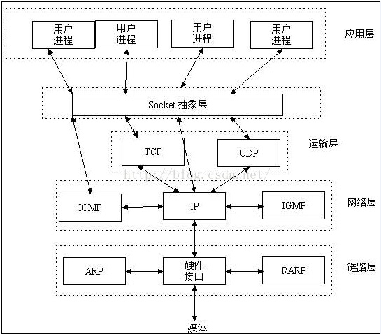
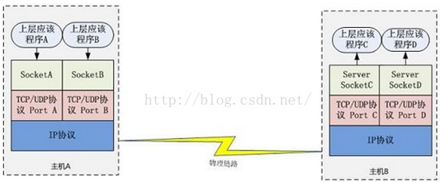

# 10029-Socket长连接和短连接的区别

**1、短连接**

连接->传输数据->关闭连接

HTTP是无状态的，浏览器和服务器每进行一次HTTP操作，就建立一次连接，但任务结束后就中断连接。短连接是指SOCKET连接后发送后接收完数据后马上断开连接。

**2、长连接**

连接->传输数据->保持连接->传输数据->....->关闭连接

长连接指建立SOCKET连接后不管是否使用都保持连接，但安全性较差。

**3、http的长连接**

HTTP也可以建立长连接的，使用Connection:keep-alive,HTTP1.1默认进行持久连接。HTTP1.1和HTTP1.0相比较而言，最大的区别就是增加了持久连接支持，但还是无状态的，或者说是不可以信任的。

那什么场景下使用长连接或者短连接？

长连接多用于操作频繁，点对点的通讯(及时通讯)，而且连接数不能太多。每个TCP连接都需要三次握手，建立连接，会比较耗时。如果每个操作都要先连接，再操作的话，处理速度会降低很多。长连接的特点是每个操作完后都不断开连接，直接发送数据包就可以了，不需要每次都建立连接。

使用场景如下：

1.数据库的连接用长连接。如果用短连接频繁的通信会造成socket错误，而且频繁的socket创建也是对资源的浪费。

2.像web网站的http服务一般都是用短连接，因为长连接对于服务器来说会耗费一定的资源，而像WEB网站这么频繁的成千上万甚至上亿客户端的连接用短连接会更省一点资源，如果用长连接，而且同时又成千上万的用户，如果每个用户都占用一个连接的话，并发量大，对服务器的压力比较大。如果每个用户无需频繁操作情况下需用短连接。

在长连接中一般无法判断读写什么时候结束，必须要加长度报文头。读函数先是读取报文头的长度，再根据这个长度读相应长度的报文。

**4、Socket是什么**

Socket是应用层与TCP/IP协议族通信中间软件抽象层，它是一组接口。在设计模式中，Socket其实就是一个facade模式，它把复杂的TCP/IP协议族隐藏在Socket接口后面，对用户来说，一组简单的接口就是全部，让Socket去组织数据，以符合指定的协议。

**5、通信过程：**

主机A的应用程序要能和主机B的应用程序通信，必须通过Socket建立连接，而建立Socket连接必须需要底层TCP/IP协议来建立TCP连接。建立TCP连接需要底层IP协议来寻址网络中的主机。网络层使用的iP协议可以帮助我们根据IP地址来找到目标主机，但是一台主机上可能运行着多个应用程序，如何才能与指定的应用程序通信就要通过端口号来指定。这样就可以通过Socket实例唯一代表一个主机上的一个应用程序的通信链路了。

建立通信链路

当客户端要与服务器端通信，客户端首先要创建一个Socket实例，操作系统将为这个Socket实例分配一个没有被使用的本地端口号，并创建一个包含本地和远程地址、端口号的套接字数据结构，这个数据结构将一直保存在系统中直到这个连接关闭。在创建Socket实例的构造函数正确返回之前，将要进行TCP的三次握手协议，TCP握手协议完成后，Socket实例对象将创建完成，否则将抛出IOException错误。

**6、TCP和UDP的区别**

- TCP(transport control protocol，传输控制协议)是面向连接的，面向流的，提供高可靠服务。收发两端都要有一一成对的socket，因此，发送端为了将多个发往接收端的包，更有效的发到对方，使用了优化方法(Nagle算法)，将多次间隔较小且数据量小的数据，合并成一个大的数据块，然后进行封包。这样，接收端就难于分辨出来了，必须提供科学的拆包机制。即面向流的通信是无消息保护边界的。
- UDP(user datagram protocol，用户数据报协议)是无连接的，面向消息的，提供高效率服务。不会使用块的合并优化算法，由于UDP支持的是一对多的模式，所以接收端的skbuff(套接字缓冲区)采用了链式结构来记录每一个到达的UDP包，在每个UDP包中就有了消息头(消息来源地址，端口等信息)，这样对于接收端来说，就容易进行区分处理了。即面向消息的通信是有消息保护边界的。