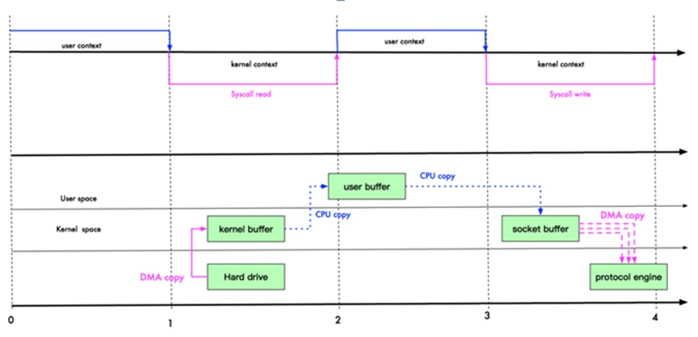
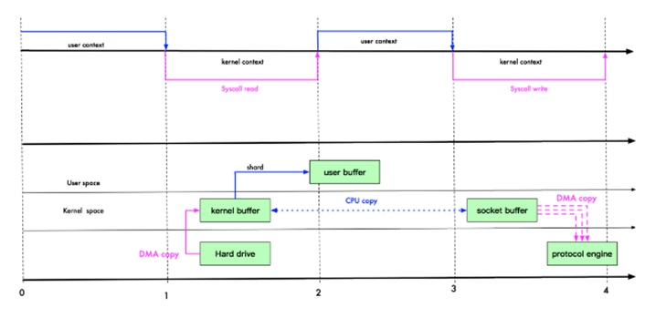
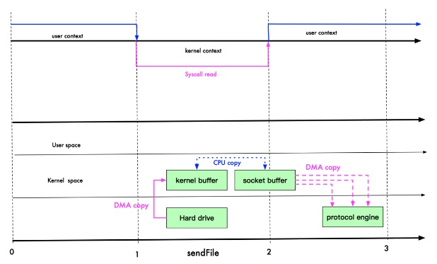
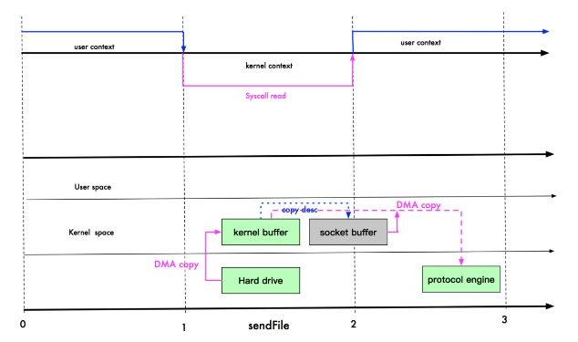

# 10032-【重要】零拷贝

**1、传统IO拷贝**

**解释**：*DMA: direct memory access 直接内存拷贝(不使用CPU)*

**2、mmap 优化**

1、mmap 通过内存映射，将文件映射到内核缓冲区，同时，用户空间可以共享内核空间的数据。这样，在进行网络传输时，就可以减少内核空间到用户控件的拷贝次数。

2、mmap示意图

**3、 sendFile 优化**

1、Linux 2.1 版本 提供了 sendFile 函数，其基本原理如下：数据根本不经过用户态，直接从内核缓冲区进入到 Socket Buffer，同时，由于和用户态完全无关，就减少了一次上下文切换。

2、示意图和小结

提示：零拷贝从操作系统角度，是没有cpu 拷贝

3、Linux 在 2.4 版本中，做了一些修改，避免了从内核缓冲区拷贝到 Socket buffer 的操作，直接拷贝到协议栈，从而再一次减少了数据拷贝。具体如下图和小结：

这里其实有 一次cpu 拷贝kernel buffer -> socket buffer

但是，拷贝的信息很少，比如lenght , offset , 消耗低，可以忽略。

**零拷贝的再次理解**

1、我们说零拷贝，是从操作系统的角度来说的。因为内核缓冲区之间，没有数据是重复的(只有 kernel buffer 有一份数据)。

2、零拷贝不仅仅带来更少的数据复制，还能带来其他的性能优势，例如更少的上下文切换，更少的 CPU 缓存伪共享以及无 CPU 校验和计算。