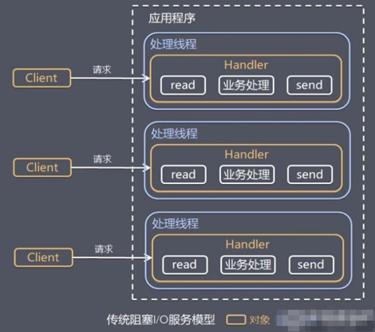

# 10040-传统阻塞 IO 服务模型

**工作原理图**

黄色的框表示对象， 蓝色的框表示线程

白色的框表示方法(API)

**模型特点**

1、采用阻塞IO模式获取输入的数据

2、每个连接都需要独立的线程完成数据的输入，业务处理,

数据返回

**问题分析**

1、当并发数很大，就会创建大量的线程，占用很大系统资源

2、连接创建后，如果当前线程暂时没有数据可读，该线程

会阻塞在read 操作，造成线程资源浪费

