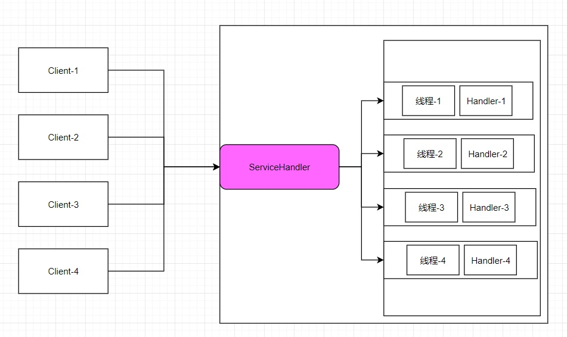

# 10041-Reactor模型图解剖析

**针对传统阻塞** **I/O** **服务模型的** **2** **个缺点，Reactor的解决方案：** 

1、基于 I/O 复用模型：多个连接共用一个阻塞对象，应用程序只需要在一个阻塞对象等待，无需阻塞等待所有连接。当某个连接有新的数据可以处理时，操作系统通知应用程序，线程从阻塞状态返回，开始进行业务处理

Reactor 对应的叫法: 

- 反应器模式 
- 分发者模式(Dispatcher) 
- 通知者模式(notifier)

2、基于线程池复用线程资源：不必再为每个连接创建线程，将连接完成后的业务处理任务分配给线程进行处理，一个线程可以处理多个连接的业务。