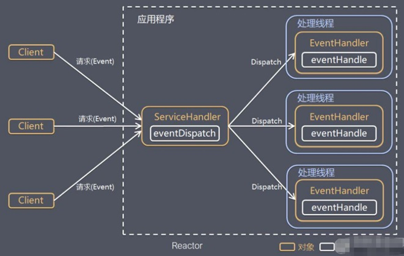

# 10042-Reactor设计思想

**I/O** **复用结合线程池，即****Reactor** **模式基本设计思想，如图：**

说明:

1、Reactor 模式，通过一个或多个输入同时传递给服务处理器的模式(基于事件驱动)

2、服务器端程序处理传入的多个请求,并将它们同步分派到相应的处理线程， 因此Reactor模式也叫 Dispatcher模式

3、Reactor 模式使用IO复用监听事件, 收到事件后，分发给某个线程(进程), 这点就是网络服务器高并发处理关键

**Reactor 模式中 核心组成：**

1、Reactor：Reactor 在一个单独的线程中运行，负责监听和分发事件，分发给适当的处理程序来对 IO 事件做出反应。 它就像公司的电话接线员，它接听来自客户的电话并将线路转移到适当的联系人；

2、Handlers：处理程序执行 I/O 事件要完成的实际事件，类似于客户想要与之交谈的公司中的实际官员。Reactor 通过调度适当的处理程序来响应 I/O 事件，处理程序执行非阻塞操作。