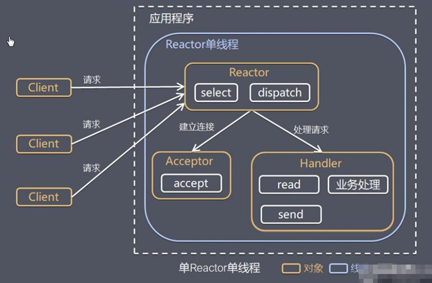

# 10044-单Reactor单线程

**工作原理示意图**

**方案说明：**

1、Select 是前面 I/O 复用模型介绍的标准网络编程 API，可以实现应用程序通过一个阻塞对象监听多路连接请求

2、Reactor 对象通过 Select 监控客户端请求事件，收到事件后通过 Dispatch 进行分发

3、如果是建立连接请求事件，则由 Acceptor 通过 Accept 处理连接请求，然后创建一个 Handler 对象处理连接完成后的后续业务处理

4、如果不是建立连接事件，则 Reactor 会分发调用连接对应的 Handler 来响应

5、Handler 会完成 Read→业务处理→Send 的完整业务流程

**结合实例****：**服务器端用一个线程通过多路复用搞定所有的 IO 操作（包括连接，读、写等），编码简单，清晰明了，但是如果客户端连接数量较多，将无法支撑，前面的 NIO 案例就属于这种模型。

**方案优缺点分析：**

1、**优点****：**模型简单，没有多线程、进程通信、竞争的问题，全部都在一个线程中完成

2、**缺点****：**性能问题，只有一个线程，无法完全发挥多核 CPU 的性能。Handler 在处理某个连接上的业务时，整个进程无法处理其他连接事件，很容易导致性能瓶颈

3、**缺点****：**可靠性问题，线程意外终止，或者进入死循环，会导致整个系统通信模块不可用，不能接收和处理外部消息，造成节点故障

4、**使用场景****：**客户端的数量有限，业务处理非常快速，比如 Redis在业务处理的时间复杂度 O(1) 的情况