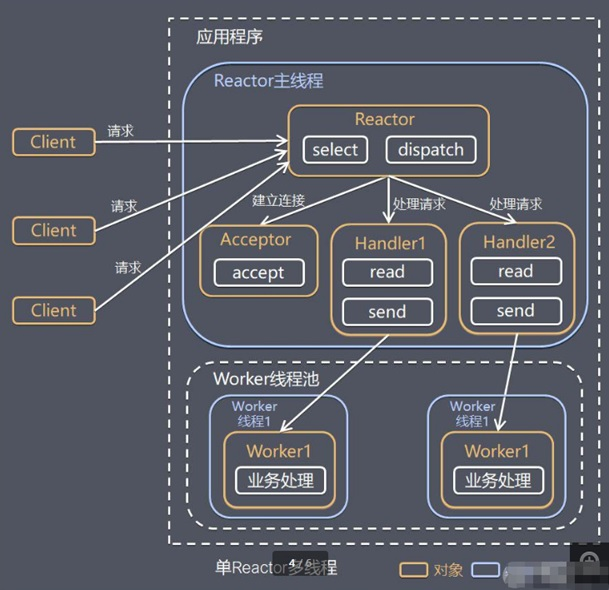

# 10045-单Reactor多线程

**工作原理示意图**

**方案说明：**

1、Reactor 对象通过select 监控客户端请求

事件, 收到事件后，通过dispatch进行分发

2、如果建立连接请求, 则右Acceptor 通过

accept 处理连接请求, 然后创建一个Handler对象处理完成连接后的各种事件

3、如果不是连接请求，则由reactor分发调用连接对应的handler 来处理

4、handler 只负责响应事件，不做具体的业务处理, 通过read 读取数据后，会分发给后面的worker线程池的某个线程处理业务

5、worker 线程池会分配独立线程完成真正的业务，并将结果返回给handler

6、handler收到响应后，通过send 将结果返回给client

**方案优缺点分析：**

1、**优点****：**可以充分的利用多核cpu 的处理能力

2、**缺点****：**多线程数据共享和访问比较复杂， reactor 处理所有的事件的监听和响应，在单线程运行， 在高并发场景容易出现性能瓶颈.