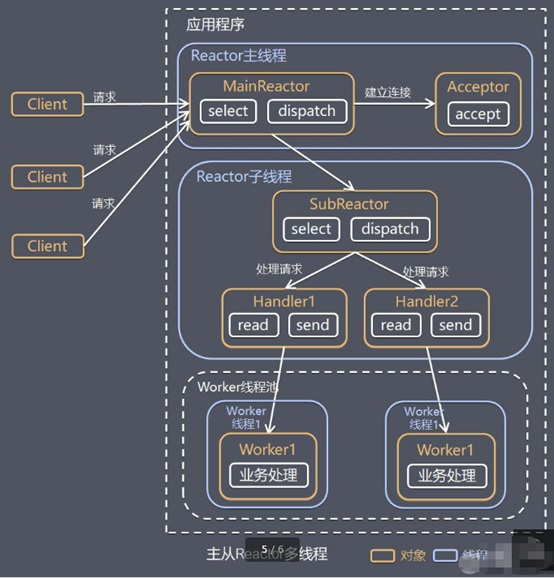
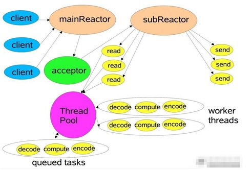

# 10046-主从Reactor多线程

**工作原理示意图**

针对单 Reactor 多线程模型中，Reactor 在单线程中运行，高并发场景下容易成为性能瓶颈，可以让 Reactor 在多线程中运行

**方案说明：**

**1**、Reactor主线程 MainReactor 对象通过select 监听连接事件, 收到事件后，通过Acceptor 处理连接事件

**2**、当 Acceptor 处理连接事件后，MainReactor 将连接分配给SubReactor

**3**、subreactor 将连接加入到连接队列进行监听,并创建handler进行各种事件处理

**4**、当有新事件发生时， subreactor 就会调用对应的handler处理

**5**、handler 通过read 读取数据，分发给后面的worker 线程处理

**6**、worker 线程池分配独立的worker 线程进行业务处理，并返回结果

**7**、handler 收到响应的结果后，再通过send 将结果返回给client

**8**、Reactor 主线程可以对应多个Reactor 子线程, 即MainRecator 可以关联多个SubReactor

**方案优缺点分析：**

1、**优点****：**父线程与子线程的数据交互简单职责明确，父线程只需要接收新连接，子线程完成后续的业务处理。

2、**优点****：**父线程与子线程的数据交互简单，Reactor 主线程只需要把新连接传给子线程，子线程无需返回数据。

3、**缺点****：**编程复杂度较高

**结合实例****：**这种模型在许多项目中广泛使用，包括 Nginx 主从 Reactor 多进程模型，Memcached 主从多线程，Netty 主从多线程模型的支持

**Scalable IO in Java 对 Multiple Reactors 的原理图解：**

