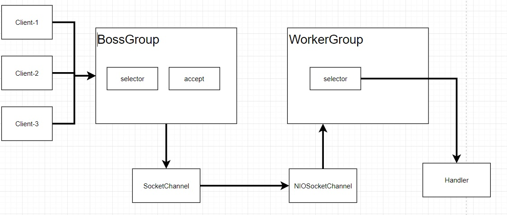
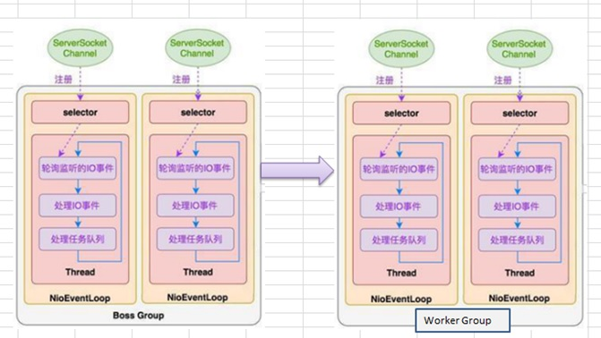
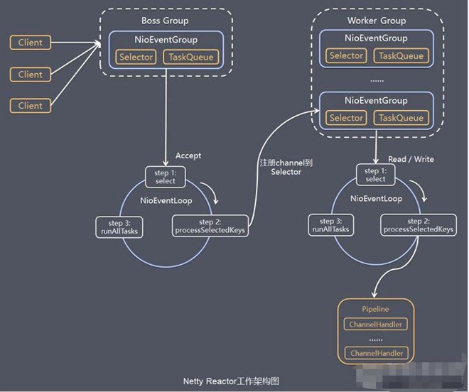

# 10048-Netty模型

一、Netty工作原理示意图-简单版

简单版方案说明

Netty 主要基于主从 Reactors 多线程模型（如图）做了一定的改进，其中主从 Reactor 多线程模型有多个 Reactor。

1、BossGroup 线程维护Selector , 只关注Accecpt

2、当接收到Accept事件，获取到对应的SocketChannel, 封装成 NIOScoketChannel并注册到Worker 线程(事件循环), 并进行维护

3、当Worker线程监听到selector 中通道发生自己感兴趣的事件后，就进行处理(就由handler)， 注意handler 已经加入到通道。

二、Netty工作原理示意图-进阶版

进阶版方案说明

Netty 主要基于**主从** **Reactors** **多线程模型**（如图）做了一定的改进，其中主从 Reactor 多线程模型有多个 Reactor

三、Netty工作原理示意图-详细版

详细版方案说明

**1、**Netty抽象出两组线程池 BossGroup 专门负责接收客户端的连接, WorkerGroup 专门负责网络的读写

**2、**BossGroup 和 WorkerGroup 类型都是 NioEventLoopGroup

**3、**NioEventLoopGroup 相当于一个事件循环组, 这个组中含有多个事件循环 ，每一个事件循环是 NioEventLoop

**4、**NioEventLoop 表示一个不断循环的执行处理任务的线程， 每个NioEventLoop 都有一个selector , 用于监听绑定在其上的socket的网络通讯

**5、**NioEventLoopGroup 可以有多个线程, 即可以含有多个NioEventLoop

**6、**每个Boss NioEventLoop 循环执行的步骤有3步

- 轮询accept 事件
- 处理accept 事件 , 与client建立连接 , 生成NioScocketChannel , 并将其注册到某个worker NIOEventLoop 上的 selector
- 处理任务队列的任务 ， 即 runAllTasks

**7、** 每个 Worker NIOEventLoop 循环执行的步骤

- 轮询read, write 事件
- 处理i/o事件， 即read , write 事件，在对应NioScocketChannel 处理
- 处理任务队列的任务 ， 即 runAllTasks

**8、** 每个Worker NIOEventLoop  处理业务时，会使用pipeline(管道), pipeline 中包含了 channel , 即通过pipeline 可以获取到对应通道, 管道中维护了很多的 处理器