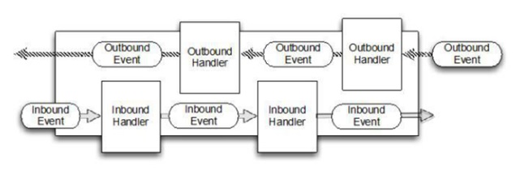

# 10052-异步模型

**基本介绍**

1、异步的概念和同步相对。当一个异步过程调用发出后，调用者不能立刻得到结果。实际处理这个调用的组件在完成后，通过状态、通知和回调来通知调用者。

2、Netty 中的 I/O 操作是异步的，包括 Bind、Write、Connect 等操作会简单的返回一个 ChannelFuture。

3、调用者并不能立刻获得结果，而是通过 Future-Listener 机制，用户可以方便的主动获取或者通过通知机制获得 IO 操作结果

4、Netty 的异步模型是建立在 future 和 callback 的之上的。callback 就是回调。重点说 Future，它的核心思想是：假设一个方法 fun，计算过程可能非常耗时，等待 fun返回显然不合适。那么可以在调用 fun 的时候，立马返回一个 Future，后续可以通过 Future去监控方法 fun 的处理过程(即 ： Future-Listener 机制)

**Future说明**

1、表示异步的执行结果, 可以通过它提供的方法来检测执行是否完成，比如检索计算等等.

2、ChannelFuture 是一个接口 ： **public interface** ChannelFuture **extends** Future<Void>

我们可以添加监听器，当监听的事件发生时，就会通知到监听器. 案例说明

**工作原理示意图**



**说明****:**

1、在使用 Netty 进行编程时，拦截操作和转换出入站数据只需要您提供 callback 或利用future 即可。这使得**链式操作**简单、高效, 并有利于编写可重用的、通用的代码。

2、Netty 框架的目标就是让你的业务逻辑从网络基础应用编码中分离出来、解脱出来。

**Future-Listener 机制**

1、当 Future 对象刚刚创建时，处于非完成状态，调用者可以通过返回的 ChannelFuture 来获取操作执行的状态，注册监听函数来执行完成后的操作。

2、常见有如下操作

- 通过 isDone 方法来判断当前操作是否完成；
- 通过 isSuccess 方法来判断已完成的当前操作是否成功；
- 通过 getCause 方法来获取已完成的当前操作失败的原因；
- 通过 isCancelled 方法来判断已完成的当前操作是否被取消；
- 通过 addListener 方法来注册监听器，当操作已完成(isDone 方法返回完成)，将会通知指定的监听器；如果 Future 对象已完成，则通知指定的监听器

3、举例说明

演示：绑定端口是异步操作，当绑定操作处理完，将会调用相应的监听器处理逻辑

```java
serverBootstrap.bind(port).addListener(future -> {
       if(future.isSuccess()) {
           System.out.println(newDate() + ": 端口["+ port + "]绑定成功!");
       }else{
           System.err.println("端口["+ port + "]绑定失败!");
       }
});
```


**小结****：**相比传统阻塞 I/O，执行 I/O 操作后线程会被阻塞住, 直到操作完成；异步处理的好处是不会造成线程阻塞，线程在 I/O 操作期间可以执行别的程序，在高并发情形下会更稳定和更高的吞吐量。