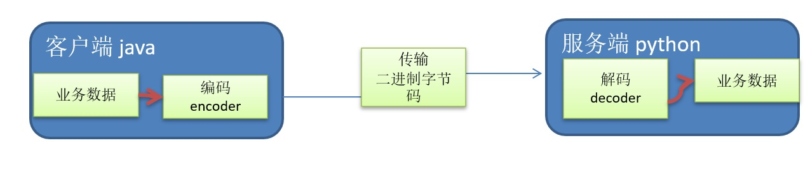
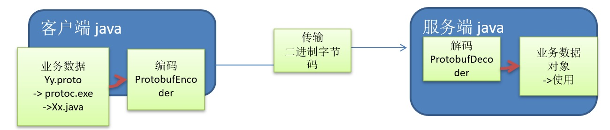
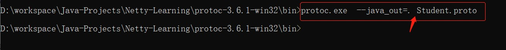

# 10058-Google-protobuf

**一、编码和解码的基本介绍**

1、编写网络应用程序时，因为数据在网络中传输的都是二进制字节码数据，在发送数据时就需要编码，接收数据时就需要解码

2、codec(编解码器) 的组成部分有两个：decoder(解码器)和 encoder(编码器)。encoder 负责把业务数据转换成字节码数据，decoder 负责把字节码数据转换成业务数据



**二、Netty 本身的编码解码的机制和问题分析**

1、Netty 自身提供了一些 codec(编解码器)

2、Netty 提供的编码器

- StringEncoder，对字符串数据进行编码
- ObjectEncoder，对 Java 对象进行编码

3、Netty 提供的解码器

- StringDecoder, 对字符串数据进行解码
- ObjectDecoder，对 Java 对象进行解码

4、Netty 本身自带的 ObjectDecoder 和 ObjectEncoder 可以用来实现 POJO 对象或各种业务对象的编码和解码，底层使用的仍是 Java 序列化技术 , 而Java 序列化技术本身效率就不高，存在如下问题

- 无法跨语言
- 序列化后的体积太大，是二进制编码的 5 倍多。
- 序列化性能太低

=> 引出 新的解决方案 [Google 的 Protobuf]

**三、Protobuf基本介绍和使用示意图**

1、Protobuf 是 Google 发布的开源项目，全称 Google Protocol Buffers，是一种轻便高效的结构化数据存储格式，可以用于结构化数据串行化，或者说序列化。它很适合做数据存储或 RPC[远程过程调用  remote procedure call ] 数据交换格式 。目前很多公司 http+json -> tcp+protobuf

2、参考文档 : https://developers.google.com/protocol-buffers/docs/proto   语言指南

3、Protobuf 是以 message 的方式来管理数据的.

4、支持跨平台、跨语言，即[客户端和服务器端可以是不同的语言编写的] （支持目前绝大多数语言，例如 C++、C#、Java、python 等）

5、高性能，高可靠性

6、使用 protobuf 编译器能自动生成代码，Protobuf 是将类的定义使用.proto 文件进行描述。说明，在idea 中编写 .proto 文件时，会自动提示是否下载 .ptotot 编写插件. 可以让语法高亮。

7、然后通过 protoc.exe 编译器根据.proto 自动生成.java 文件

8、protobuf 使用示意图



**四、编写程序，使用Protobuf完成如下功能**

1、客户端可以发送一个Student  PoJo 对象到服务器 (通过 Protobuf 编码) 

3、服务端能接收Student PoJo 对象，并显示信息(通过 Protobuf 解码)

**五、Student.proto 代码**

```java
syntax = "proto3";//版本
option java_outer_classname = "StudentPOJO";//生成的外部类名，同时也是文件名
//protobuf 使用message 管理数据
message Student { //会在 StudentPOJO 外部类生成一个内部类 Student,他是真正发送的POJO对象
  int32 id = 1; //Student类中有一个属性 名字为 id 类型为int32(protobuf类型) 1表示属性序号，不是值
  string name = 2;
}
```


**六、手工编译**

1、把上面的Student.proto文件放在protoc.exe同级目录下

2、执行命令行# protoc.exe --java_out=. Student.proto

3、生成StudentPOJO.java文件，拷贝到工程中使用



**七、服务端代码**

```java
import io.netty.bootstrap.ServerBootstrap;
import io.netty.channel.*;
import io.netty.channel.nio.NioEventLoopGroup;
import io.netty.channel.socket.SocketChannel;
import io.netty.channel.socket.nio.NioServerSocketChannel;
import io.netty.handler.codec.protobuf.ProtobufDecoder;

/**
 * @description:protobuf of google example
 * @author:mangxiao2018@126.com
 * @date:2021-3-26
 */
public class Server {
    public static void main(String[] args) throws Exception{
        //创建BossGroup 和 WorkerGroup
        //说明
        //1. 创建两个线程组 bossGroup 和 workerGroup
        //2. bossGroup 只是处理连接请求 , 真正的和客户端业务处理，会交给 workerGroup完成
        //3. 两个都是无限循环
        //4. bossGroup 和 workerGroup 含有的子线程(NioEventLoop)的个数
        //   默认实际 cpu核数 * 2
        EventLoopGroup bossGroup = new NioEventLoopGroup(1);
        EventLoopGroup workerGroup = new NioEventLoopGroup();
        try {
            //创建服务器端的启动对象，配置参数
            ServerBootstrap bootstrap = new ServerBootstrap();
            bootstrap.group(bossGroup, workerGroup);
            //使用NioSocketChannel 作为服务器的通道实现
            bootstrap.channel(NioServerSocketChannel.class);
            // 设置线程队列得到连接个数
            bootstrap.option(ChannelOption.SO_BACKLOG, 128);
            //设置保持活动连接状态
            bootstrap.childOption(ChannelOption.SO_KEEPALIVE, true);
            //创建一个通道初始化对象(匿名对象)
            bootstrap.childHandler(new ChannelInitializer<SocketChannel>() {
                @Override
                protected void initChannel(SocketChannel channel) throws Exception {
                    ChannelPipeline pipeline = channel.pipeline();
                    //在pipeline加入ProtoBufDecoder
                    //指定对哪种对象进行解码
                    pipeline.addLast("decoder",
                            new ProtobufDecoder(StudentPOJO.Student.getDefaultInstance()));
                    pipeline.addLast(new ServerHandler());
                }
            });
            System.out.println("---==- 服务器 is ready...");

            ChannelFuture future = bootstrap.bind(6668).sync();
            future.addListener(new ChannelFutureListener() {
                @Override
                public void operationComplete(ChannelFuture channelFuture) throws Exception {
                    if (future.isSuccess()){
                        System.out.println("监听端口 6668 成功");
                    }else{
                        System.out.println("监听端口 6668 失败");
                    }
                }
            });
            future.channel().closeFuture().sync();
        }finally {
            bossGroup.shutdownGracefully();
            workerGroup.shutdownGracefully();
        }
    }
}
```

**八、服务端handler代码**

```java
import io.netty.buffer.Unpooled;
import io.netty.channel.ChannelHandlerContext;
import io.netty.channel.SimpleChannelInboundHandler;
import io.netty.util.CharsetUtil;

/**
 * @description:handler of protobuf server of google example
 * @author:mangxiao2018@126.com
 * @date:2021-3-26
 */
public class ServerHandler extends SimpleChannelInboundHandler<StudentPOJO.Student> {
    @Override
    protected void channelRead0(ChannelHandlerContext ctx, StudentPOJO.Student msg) throws Exception {
        System.out.println("客户端发送的数据 id=" + msg.getId() + "名字=" + msg.getName());
    }

    @Override
    public void channelReadComplete(ChannelHandlerContext ctx) throws Exception {
        ctx.writeAndFlush(Unpooled.copiedBuffer("hello, 客户端!", CharsetUtil.UTF_8));
    }

    @Override
    public void exceptionCaught(ChannelHandlerContext ctx, Throwable cause) throws Exception {
        ctx.close();
    }
}
```

**九、客户端代码**

```java
import io.netty.bootstrap.Bootstrap;
import io.netty.channel.ChannelFuture;
import io.netty.channel.ChannelInitializer;
import io.netty.channel.ChannelPipeline;
import io.netty.channel.EventLoopGroup;
import io.netty.channel.nio.NioEventLoopGroup;
import io.netty.channel.socket.SocketChannel;
import io.netty.channel.socket.nio.NioServerSocketChannel;
import io.netty.handler.codec.protobuf.ProtobufEncoder;

/**
 * @description:protobuf client of google example
 * @author:mangxiao2018@126.com
 * @date:2021-3-26
 */
public class Client {
    public static void main() throws Exception{
        EventLoopGroup group = new NioEventLoopGroup();
        try {
            Bootstrap bootstrap = new Bootstrap();
            bootstrap.group(group);
            bootstrap.channel(NioServerSocketChannel.class);
            bootstrap.handler(new ChannelInitializer<SocketChannel>() {
                @Override
                protected void initChannel(SocketChannel channel) throws Exception {
                    ChannelPipeline pipeline = channel.pipeline();
                    //在pipeline中加入 ProtoBufEncoder
                    pipeline.addLast("encoder", new ProtobufEncoder());
                    pipeline.addLast(new ClientHandler());
                }
            });
            System.out.println("客户端ok..");
            ChannelFuture future = bootstrap.connect("127.0.0.1", 6668).sync();
            future.channel().closeFuture().sync();
        }finally {
            group.shutdownGracefully();
        }
    }
}
```

**十、客户端handler代码**

```java
import com.netty.mangxiao.nio.ChannelInboundHandlerAdapter;
import io.netty.buffer.ByteBuf;
import io.netty.channel.ChannelHandlerContext;
import io.netty.util.CharsetUtil;

/**
 * @description:handler of protobuf client of google example
 * @author:mangxiao2018@126.com
 * @date:2021-3-26
 */
public class ClientHandler extends ChannelInboundHandlerAdapter {
    @Override
    public void channelActive(ChannelHandlerContext ctx) throws Exception {
        StudentPOJO.Student student = StudentPOJO.Student
                .newBuilder().setId(4).setName("芒硝 张艳青").build();
        ctx.writeAndFlush(student);
    }

    @Override
    public void channelRead(ChannelHandlerContext ctx, Object msg) throws Exception {
        ByteBuf buf = (ByteBuf) msg;
        System.out.println("服务器回复的消息:" + buf.toString(CharsetUtil.UTF_8));
        System.out.println("服务器的地址：" + ctx.channel().remoteAddress());
    }

    @Override
    public void exceptionCaught(ChannelHandlerContext ctx, Throwable cause) throws Exception {
        cause.printStackTrace();
        ctx.close();
    }
}
```

