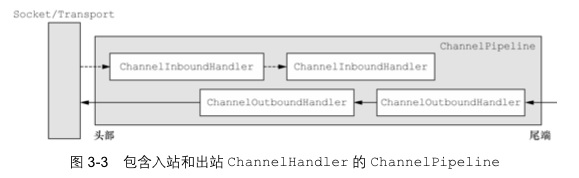
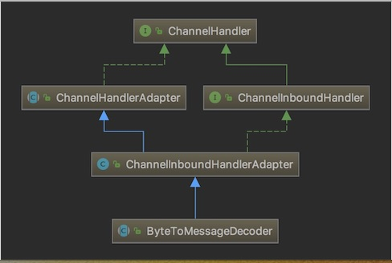
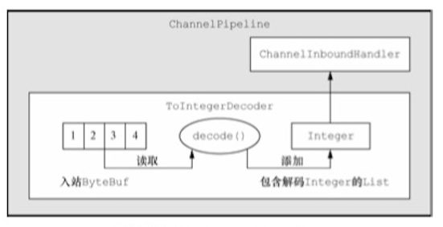
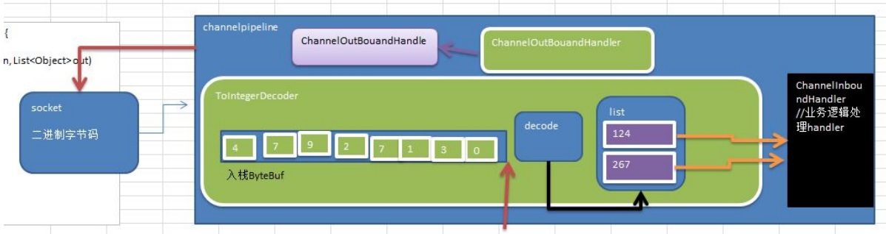

# 10059-Netty编解码器

**一、基本介绍**

1、netty的组件设计：Netty的主要组件有Channel、EventLoop、ChannelFuture、ChannelHandler、ChannelPipe等

2、ChannelHandler充当了处理入站和出站数据的应用程序逻辑的容器。例如，实现ChannelInboundHandler接口（或ChannelInboundHandlerAdapter），你就可以接收入站事件和数据，这些数据会被业务逻辑处理。当要给客户端发送响应时，也可以从ChannelInboundHandler冲刷数据。业务逻辑通常写在一个或者多个ChannelInboundHandler中。ChannelOutboundHandler原理一样，只不过它是用来处理出站数据的

3、ChannelPipeline提供了ChannelHandler链的容器。以客户端应用程序为例，如果事件的运动方向是从客户端到服务端的，那么我们称这些事件为出站的，即客户端发送给服务端的数据会通过pipeline中的一系列ChannelOutboundHandler，并被这些Handler处理，反之则称为入站的



**二、编码解码器**

1、当Netty发送或者接受一个消息的时候，就将会发生一次数据转换。入站消息会被解码：从字节转换为另一种格式（比如java对象）；如果是出站消息，它会被编码成字节。

2、Netty提供一系列实用的编解码器，他们都实现了ChannelInboundHadnler或者ChannelOutboundHandler接口。在这些类中，channelRead方法已经被重写了。以入站为例，对于每个从入站Channel读取的消息，这个方法会被调用。随后，它将调用由解码器所提供的decode()方法进行解码，并将已经解码的字节转发给ChannelPipeline中的下一个ChannelInboundHandler。

**三、解码器-ByteToMessageDecoder**

1、关系继承图



2、由于不可能知道远程节点是否会一次性发送一个完整的信息，tcp有可能出现粘包拆包的问题，这个类会对入站数据进行缓冲，直到它准备好被处理.

3、一个关于ByteToMessageDecoder实例分析

```java
import java.util.List;
/**
 * @description: decoder1
 * @author:mangxiao2018@126.com
 * @date:2021-4-14
 */
public class MyByteToLongDecoder1 extends ByteToMessageDecoder {
    @Override
    protected void decode(ChannelHandlerContext ctx, ByteBuf in, List<Object> out) throws Exception {
        System.out.println("MyByteToLongDecoder1 被调用了");
        if (in.readableBytes() >= 8){
            out.add(in.readLong());
        }
    }
}
```

说明：

- 这个例子，每次入站从ByteBuf中读取4字节，将其解码为一个int，然后将它添加到下一个List中。当没有更多元素可以被添加到该List中时，它的内容将会被发送给下一个ChannelInboundHandler。int在被添加到List中时，会被自动装箱为Integer。在调用readInt()方法前必须验证所输入的ByteBuf是否具有足够的数据

- decode 执行分析图 [示意图]



