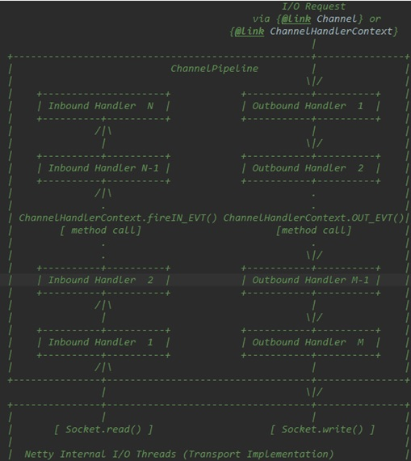
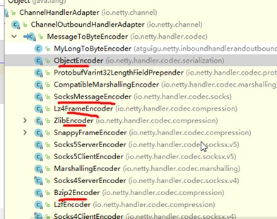

# 10060-Netty的Handler调用机制

**一、Handler调用机制图**

**二、实例要求**  

1、使用自定义的编码器和解码器来说明Netty的handler 调用机制

客户端发送long -> 服务器

服务端发送long -> 客户端

2、结论

- 不论解码器handler 还是 编码器handler 即接收的消息类型必须与待处理的消息类型一致，否则该handler不会被执行

- 在解码器 进行数据解码时，需要判断 缓存区(ByteBuf)的数据是否足够 ，否则接收到的结果会期望结果可能不一致

**三、解码器-ReplayingDecoder**

1、public abstract class ReplayingDecoder<S> extends ByteToMessageDecoder

2、ReplayingDecoder扩展了ByteToMessageDecoder类，使用这个类，我们不必调用readableBytes()方法。参数S指定了用户状态管理的类型，其中Void代表不需要状态管理

3、应用实例：使用ReplayingDecoder 编写解码器，对前面的案例进行简化 [案例演示]

4、ReplayingDecoder使用方便，但它也有一些局限性：

- 并不是所有的 ByteBuf 操作都被支持，如果调用了一个不被支持的方法，将会抛出一个 UnsupportedOperationException。
- ReplayingDecoder 在某些情况下可能稍慢于 ByteToMessageDecoder，例如网络缓慢并且消息格式复杂时，消息会被拆成了多个碎片，速度变慢

**四、其它编解码器**

**1、其它解码器**

1.1、LineBasedFrameDecoder：这个类在Netty内部也有使用，它使用行尾控制字符（\n或者\r\n）作为分隔符来解析数据。

1.2、DelimiterBasedFrameDecoder：使用自定义的特殊字符作为消息的分隔符。

1.3、HttpObjectDecoder：一个HTTP数据的解码器

1.4、LengthFieldBasedFrameDecoder：通过指定长度来标识整包消息，这样就可以自动的处理黏包和半包消息。

**2、其它编码器**

